# Sơ đồ Use Case của người chơi

Sơ đồ thể hiện đồng thời chức năng tổng quát ở **mức 1** và các chức năng được phân rã ở **mức 2**. Những chức năng chỉ xuất hiện trong một điều kiện hoặc một kiểu nhiệm vụ cụ thể dùng quan hệ `«extend»`.

```mermaid
flowchart LR
    PLAYER["👤<br/>NGƯỜI CHƠI"]

    subgraph GAME["HỆ THỐNG TOP DOWN SHOOTER 3D"]
        direction TB

        subgraph L1["USE CASE MỨC 1 — CHỨC NĂNG TỔNG QUÁT"]
            direction LR
            UC1(["1. Thiết lập trận chơi"])
            UC2(["2. Tham gia chiến đấu"])
            UC3(["3. Chơi Co-op LAN"])
            UC4(["4. Quản lý phiên chơi"])
            UC5(["5. Xem và xử lý kết quả"])
        end

        subgraph L2["USE CASE MỨC 2 — CHỨC NĂNG CHI TIẾT"]
            direction TB

            subgraph SETUP["2.1 Chi tiết thiết lập trận chơi"]
                direction LR
                UC11(["Chọn chế độ chơi"])
                UC12(["Chọn nhiệm vụ"])
                UC13(["Chọn tối đa 2 vũ khí"])
                UC14(["Xem truyện mở đầu"])
                UC15(["Bắt đầu trận"])
            end

            subgraph COMBAT["2.2 Chi tiết tham gia chiến đấu"]
                direction LR
                UC21(["Di chuyển và chạy"])
                UC22(["Ngắm bắn"])
                UC23(["Tấn công kẻ địch"])
                UC24(["Quản lý vũ khí"])
                UC25(["Tương tác vật phẩm"])
                UC26(["Thực hiện nhiệm vụ"])
                UC27(["Sử dụng phương tiện"])
                UC28(["Theo dõi HUD"])

                UC231(["Bắn / gây sát thương"])
                UC232(["Nạp đạn"])
                UC241(["Đổi vũ khí"])
                UC242(["Nhặt vũ khí"])
                UC243(["Nhặt đạn"])
                UC271(["Lên xe"])
                UC272(["Lái xe"])
                UC273(["Xuống xe"])
            end

            subgraph MISSIONS["2.3 Các biến thể thực hiện nhiệm vụ"]
                direction LR
                UC261(["Sống sót theo thời gian"])
                UC262(["Tìm chìa khóa"])
                UC263(["Săn mục tiêu"])
                UC264(["Phòng thủ vị trí"])
                UC265(["Giao xe"])
                UC266(["Đến điểm thoát"])
            end

            subgraph COOP["2.4 Chi tiết chơi Co-op LAN"]
                direction LR
                UC31(["Nhập tên hiển thị"])
                UC32(["Tạo phòng / làm Host"])
                UC33(["Xem và làm mới danh sách phòng"])
                UC34(["Tham gia phòng"])
                UC35(["Sẵn sàng / hủy sẵn sàng"])
                UC36(["Host chọn nhiệm vụ"])
                UC37(["Mỗi người chọn bộ vũ khí"])
                UC38(["Host bắt đầu trận"])
                UC39(["Phối hợp tiến độ nhiệm vụ chung"])
            end

            subgraph SESSION["2.5 Chi tiết quản lý phiên chơi"]
                direction LR
                UC41(["Tạm dừng cục bộ"])
                UC42(["Tiếp tục chơi"])
                UC43(["Điều chỉnh âm thanh SFX/BGM"])
                UC44(["Bật/tắt sát thương đồng đội"])
                UC45(["Trở về menu"])
                UC46(["Thoát trò chơi"])
            end

            subgraph RESULT["2.6 Chi tiết kết quả trận"]
                direction LR
                UC51(["Xem chiến thắng"])
                UC52(["Xem Game Over"])
                UC53(["Chơi lại"])
                UC54(["Trở về menu chính"])
            end
        end

        UC1 -. "«include»" .-> UC11
        UC1 -. "«include»" .-> UC12
        UC1 -. "«include»" .-> UC13
        UC1 -. "«include»" .-> UC14
        UC1 -. "«include»" .-> UC15

        UC2 -. "«include»" .-> UC21
        UC2 -. "«include»" .-> UC22
        UC2 -. "«include»" .-> UC23
        UC2 -. "«include»" .-> UC24
        UC2 -. "«include»" .-> UC25
        UC2 -. "«include»" .-> UC26
        UC2 -. "«extend»" .-> UC27
        UC2 -. "«include»" .-> UC28

        UC23 -. "«include»" .-> UC231
        UC23 -. "«extend»" .-> UC232
        UC24 -. "«include»" .-> UC241
        UC25 -. "«extend»" .-> UC242
        UC25 -. "«extend»" .-> UC243
        UC27 -. "«include»" .-> UC271
        UC27 -. "«include»" .-> UC272
        UC27 -. "«include»" .-> UC273

        UC261 -. "«extend»" .-> UC26
        UC262 -. "«extend»" .-> UC26
        UC263 -. "«extend»" .-> UC26
        UC264 -. "«extend»" .-> UC26
        UC265 -. "«extend»" .-> UC26
        UC26 -. "«include»" .-> UC266

        UC3 -. "«include»" .-> UC31
        UC3 -. "«extend»" .-> UC32
        UC3 -. "«extend»" .-> UC33
        UC3 -. "«extend»" .-> UC34
        UC3 -. "«include»" .-> UC35
        UC3 -. "«include»" .-> UC36
        UC3 -. "«include»" .-> UC37
        UC3 -. "«include»" .-> UC38
        UC3 -. "«include»" .-> UC39

        UC4 -. "«include»" .-> UC41
        UC41 -. "«extend»" .-> UC42
        UC4 -. "«extend»" .-> UC43
        UC4 -. "«extend»" .-> UC44
        UC4 -. "«extend»" .-> UC45
        UC4 -. "«extend»" .-> UC46

        UC5 -. "«extend»" .-> UC51
        UC5 -. "«extend»" .-> UC52
        UC5 -. "«extend»" .-> UC53
        UC5 -. "«extend»" .-> UC54
    end

    PLAYER --> UC1
    PLAYER --> UC2
    PLAYER --> UC3
    PLAYER --> UC4
    PLAYER --> UC5

    classDef actor fill:#263238,color:#fff,stroke:#111,stroke-width:2px;
    classDef level1 fill:#1565c0,color:#fff,stroke:#0d47a1,stroke-width:3px;
    classDef level2 fill:#e3f2fd,color:#102027,stroke:#42a5f5,stroke-width:1.5px;
    class PLAYER actor;
    class UC1,UC2,UC3,UC4,UC5 level1;
    class UC11,UC12,UC13,UC14,UC15,UC21,UC22,UC23,UC24,UC25,UC26,UC27,UC28,UC231,UC232,UC241,UC242,UC243,UC261,UC262,UC263,UC264,UC265,UC266,UC271,UC272,UC273,UC31,UC32,UC33,UC34,UC35,UC36,UC37,UC38,UC39,UC41,UC42,UC43,UC44,UC45,UC46,UC51,UC52,UC53,UC54 level2;
```

## Quy ước

- Màu xanh đậm: use case **mức 1**.
- Màu xanh nhạt: use case **mức 2**.
- `«include»`: chức năng con bắt buộc hoặc được dùng chung trong use case cha.
- `«extend»`: chức năng tùy chọn, có điều kiện hoặc là một biến thể của use case cha.
- Các thao tác “Host chọn nhiệm vụ” và “Host bắt đầu trận” chỉ áp dụng khi người chơi giữ vai trò Host trong phòng Co-op.
