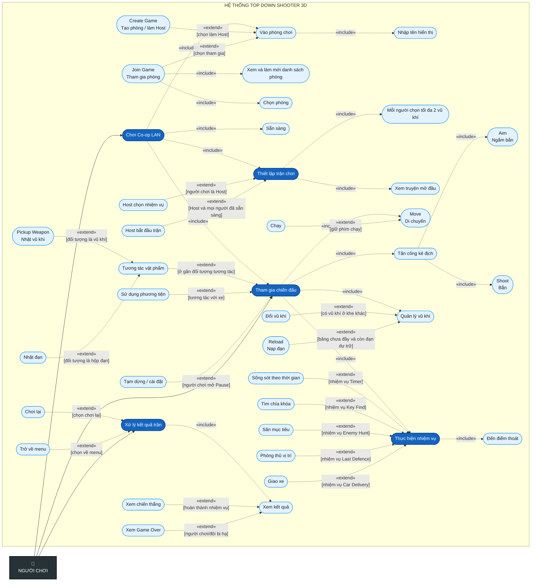

# Sơ đồ Use Case người chơi — include và extend

Sơ đồ này mở rộng trực tiếp các use case trong hình ban đầu (`Join Game`, `Create Game`, `Move`, `Aim`, `Shoot`, `Reload`, `Pickup Weapon`) theo chương trình hiện tại.

## Quy ước và lựa chọn mô hình

- `A «include» B`: B là hành vi con bắt buộc hoặc được A tái sử dụng; mũi tên đi từ A sang B.
- `A «extend» B`: A chỉ bổ sung cho B khi điều kiện trong ngoặc vuông xảy ra; mũi tên đi từ A sang B.
- `Create Game` và `Join Game` là hai nhánh thay thế của `Vào phòng chơi`; người chơi chỉ chọn một vai trò tại một thời điểm.
- `Reload` mở rộng `Quản lý vũ khí`, không mở rộng trực tiếp `Shoot`, vì code cho phép chủ động nạp đạn ngay cả khi chưa bắn.

## Căn cứ từ chương trình hiện tại

| Nhóm chức năng | Mã nguồn xác nhận |
|---|---|
| Tạo/duyệt/tham gia phòng và Ready | `UI_CoopMenu`, `CoopNetworkManager` |
| Host chọn nhiệm vụ; mỗi người chọn vũ khí; comic; Host Play | `CoopNetworkManager`, `UI`, `UI_MissionSelection`, `UI_WeaponSelection` |
| Di chuyển/chạy, ngắm, bắn, nạp và đổi vũ khí | `Player_Movement`, `Player_AimController`, `Player_WeaponController`, `NetworkPlayerWeapon` |
| Nhặt súng/đạn theo tương tác có điều kiện | `Player_Interaction`, `Pickup_Weapon`, `Pickup_Ammo`, `CoopPickupCoordinator` |
| Các biến thể nhiệm vụ và sử dụng xe | `Mission_*`, `MissionObject_*`, `Car_Interaction`, `Car_Controller` |
| Pause, chiến thắng, Game Over, chơi lại/về menu | `UI`, `GameManager`, `CoopPostMatchFlow`, `CoopTeamDeathHandler` |

> Phạm vi đúng với code hiện tại: Co-op dùng Host/Client; Host chọn nhiệm vụ và bắt đầu trận; mỗi người chọn bộ vũ khí; Host phân xử yêu cầu nhặt vật phẩm Co-op hợp lệ đầu tiên.
