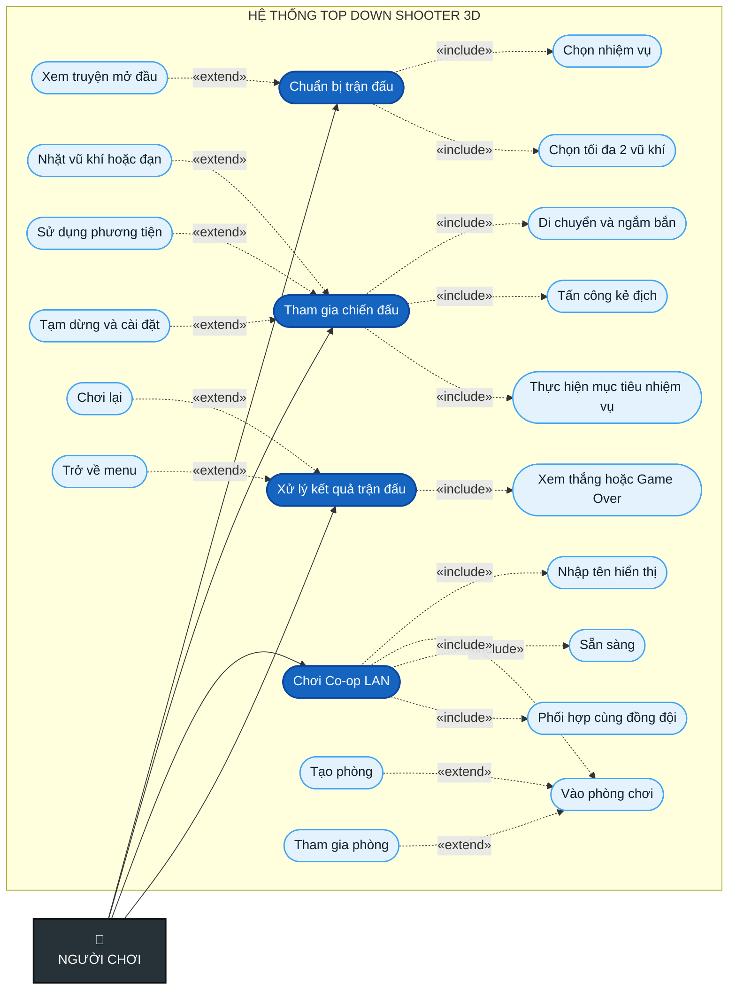

# Sơ đồ Use Case của người chơi

Sơ đồ được giới hạn ở **2 mức**: chức năng tổng quát và chức năng con trực tiếp.

## Quy ước

- `«include»`: chức năng bắt buộc hoặc luôn được sử dụng trong use case chính.
- `«extend»`: chức năng tùy chọn hoặc chỉ xảy ra khi có điều kiện.
- Xanh đậm: use case mức 1; xanh nhạt: use case mức 2.
